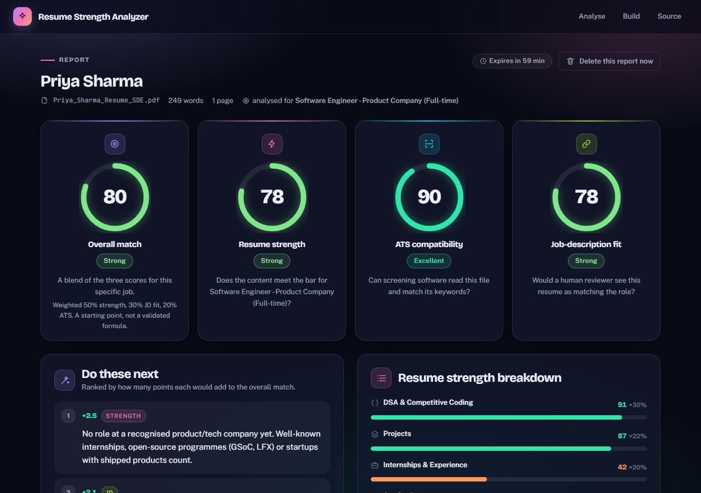
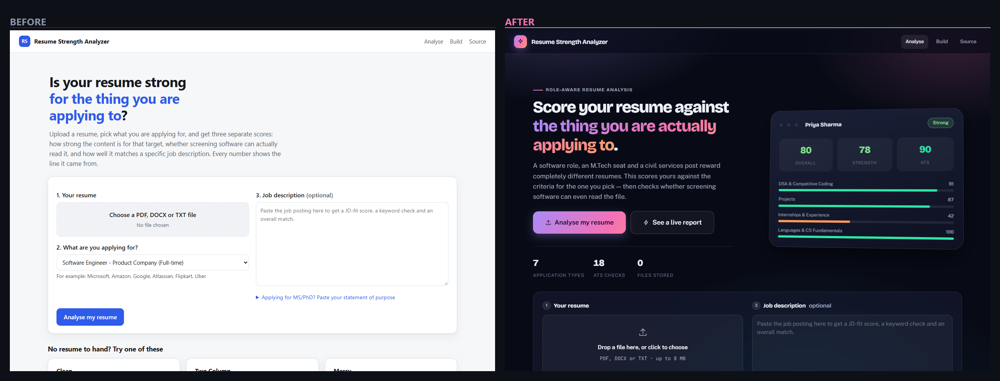
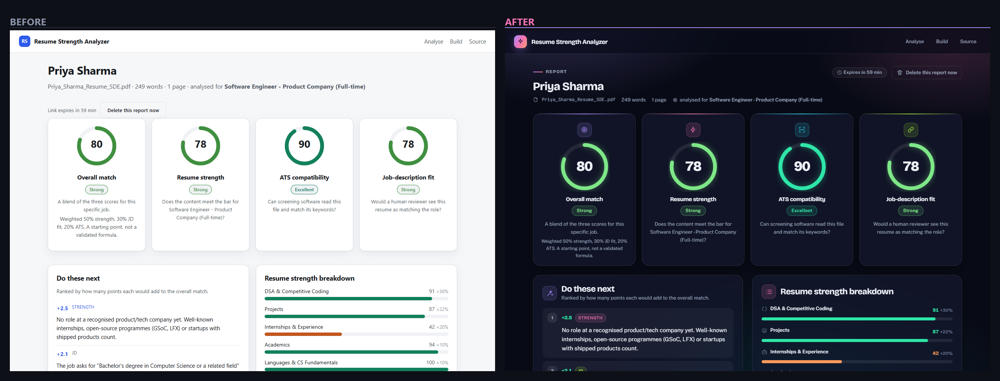
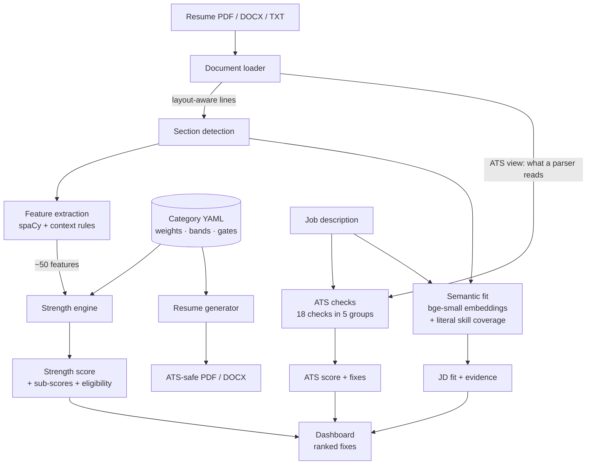
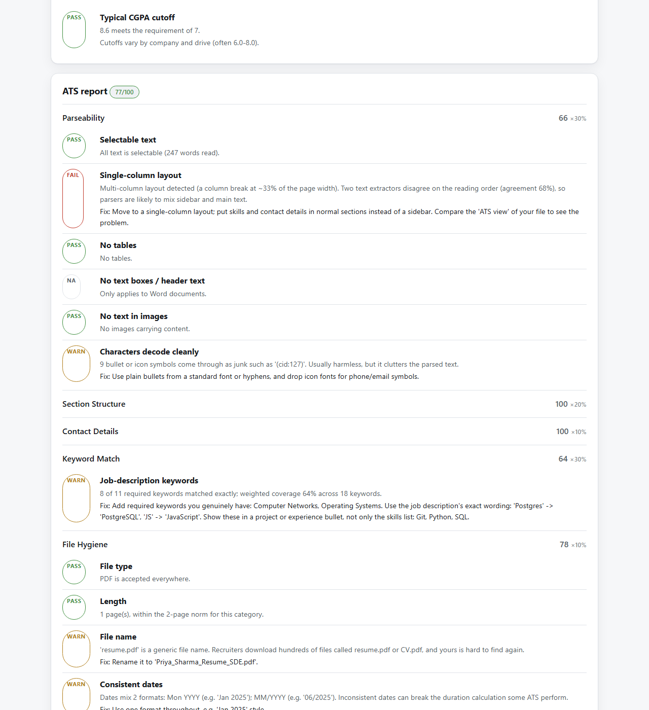
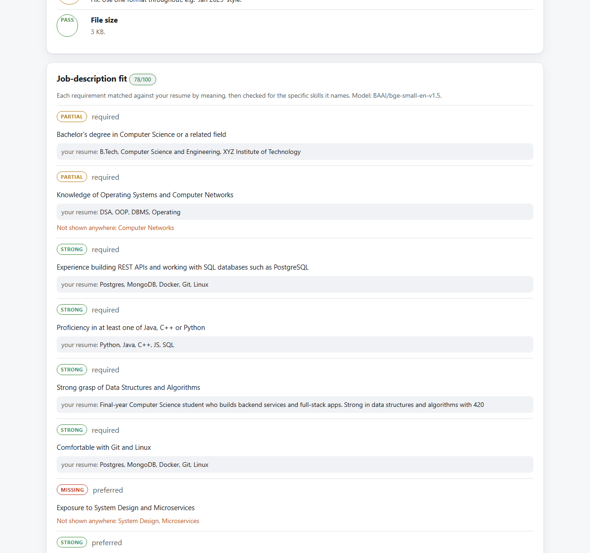
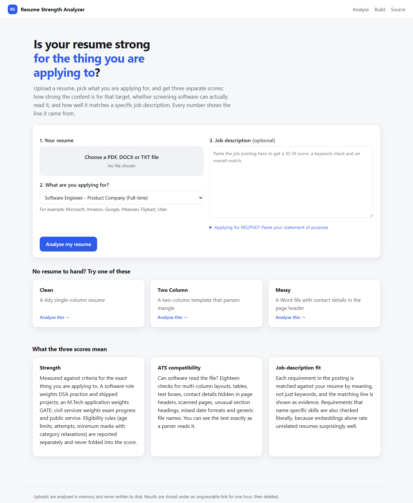
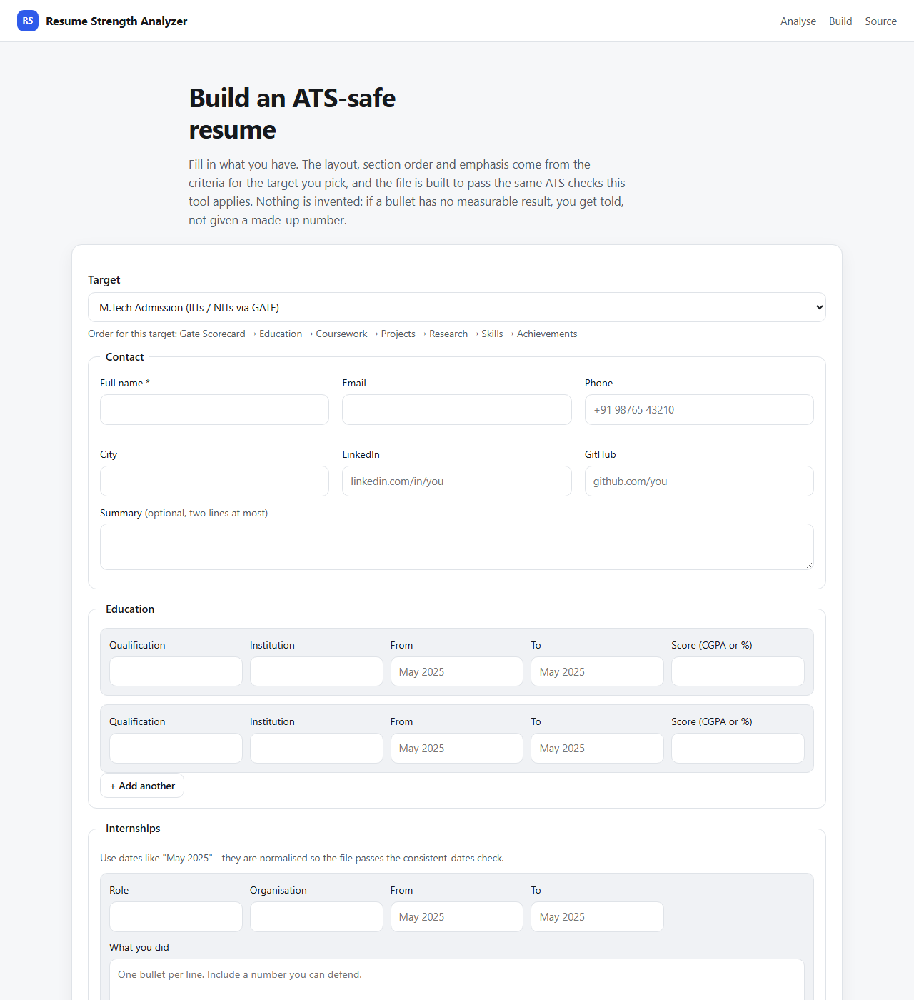

# Resume Strength Analyzer

**Is your resume strong _for the specific thing you are applying to_?**

Upload a resume, pick a target, and get three separate scores — how strong the content is
for that target, whether screening software can actually read the file, and how well it
matches a pasted job description. Every number shows the line of the resume it came from.

> **Live demo:** https://huggingface.co/spaces/Dhar1503/resume-strength-analyzer
> **Source:** https://github.com/Dhar1503/Role-Aware-Resume-Analyzer



---

## Before / after

The first version worked but looked like a form with a title on top of it, so I rebuilt the
interface around a documented design system rather than patching it: a dark canvas under a
gradient mesh, glass panels, one signature gradient, a fixed hue per score dimension and a
separate five-step scale for score bands. The rules live in
[docs/design-system.md](docs/design-system.md).

**Landing page**



**Dashboard**



Also redesigned: the [builder](docs/screenshots/before-after/builder-before-after.png) and the
[phone layout](docs/screenshots/before-after/mobile-before-after.png), where four full-height
score cards became a horizontal card that fits four scores on one screen.

Reviewing it as screenshots rather than trusting the test suite is what found the real
defects — status pills stretched by `align-self: stretch`, a hero card whose transform was
cancelled by a competing animation, bar fills with no height because `<i>` is inline, and
`auto-fit` grids whose fixed column floor overflowed any viewport under 390px. Pages are now
checked for overflow at 320 / 390 / 480 / 768 / 1024 / 1280 / 1600.

---

## The problem

Most resume scorers give one number out of 100 from a fixed checklist, which means they
answer a question nobody asked. A resume for a **software engineering role** lives or dies on
DSA practice and shipped projects; one for an **M.Tech admission** lives on a GATE score; one
for **civil services** is decided by an exam the resume cannot influence at all, where what
matters is eligibility — age limits, attempts used, category relaxations.

A single number also hides the difference between two very different failures:

| | Content | File |
|---|---|---|
| A strong candidate with a two-column template | Excellent | Parsers scramble it |
| A weak candidate with a clean template | Thin | Perfectly readable |

One score cannot say both things. This tool keeps them apart.

## What makes it different

- **Criteria live in data, not code.** Each target is a YAML file: weighted sub-scores,
  scoring bands, eligibility rules, suggestion text. Adding a category is a new file —
  [see below](#adding-a-new-category).
- **Eligibility is never mixed into the score.** Age limits, attempt caps and minimum marks
  (with SC/ST/OBC/PwBD relaxations, stacking or not as the rule actually works) are reported
  separately, because a 95-point profile that is over the age limit is not a 95-point application.
- **A real ATS simulation**, not a keyword count: column detection from the page geometry,
  tables, Word text boxes, contact details hidden in page headers, scanned pages, unmapped
  glyphs, mixed date formats — plus **"what a parser reads"**, your file as screening software
  sees it.
- **Job-description fit by meaning**, with the matching resume line shown as evidence for
  every requirement.
- **It says when it doesn't know.** A resume with no structure gets "not enough information
  to score", not a confident 40.
- **It never invents content.** The builder reformats what you give it and tells you which
  bullets lack a measurable result.

## The four numbers

| Score | Question it answers |
|---|---|
| **Strength** | Does the content meet the bar for this specific target? |
| **ATS compatibility** | Can screening software read this file and match its keywords? |
| **JD fit** | Would a human reviewer see this resume as matching the role? |
| **Overall match** | A blend (50 / 30 / 20), shown only when a job description is pasted |

The blend weights are **a starting point, not a validated formula** — there is no labelled
dataset of hiring outcomes behind them.

## How it works



**Numbers are read in context.** A CGPA is found inside the education section next to its
label, a LeetCode count inside the clause that names the platform — not by scanning the whole
document for anything numeric. That is why "Class XII … St. Joseph's **High School** … 92%"
does not become a Class X percentage.

### Tech stack

| Layer | Choice | Why |
|---|---|---|
| Web | Flask, hand-written CSS | No framework or CDN; works without JavaScript |
| PDF | PyMuPDF + pdfplumber | Two independent extractors; their disagreement *is* the reading-order signal |
| DOCX | python-docx | Reaches text boxes and headers that parsers miss |
| NLP | spaCy `en_core_web_sm` | Names and organisations; rules handle domain numbers |
| Embeddings | `BAAI/bge-small-en-v1.5` (CPU) | One threshold separates real matches from noise; MiniLM's ranges overlapped |
| Validation | pydantic | A typo in a YAML file fails at startup, not silently at runtime |
| Output | ReportLab, python-docx | ATS-safe PDF and DOCX |

## Screenshots

The interface is a single dark theme: glass panels over a gradient mesh, one signature
gradient, a fixed hue per score dimension and a separate five-step colour scale for score
bands. The tokens, type pairing, motion rules and the no-JavaScript contract are written
down in [docs/design-system.md](docs/design-system.md).

| ATS report | Job-description fit |
|---|---|
|  |  |

| Upload | Builder |
|---|---|
|  |  |

## Example

Analysing a two-column resume against a software job description:

```
Overall match 79   Strength 81   ATS 77   JD fit 78

Do these next
  +2.5  strength  No role at a recognised product/tech company yet. Well-known internships,
                  open-source programmes (GSoC, LFX) or startups with shipped products count.
  +2.2  ats       Add required keywords you genuinely have: Computer Networks, Operating
                  Systems. Use the job description's exact wording: 'Postgres' -> 'PostgreSQL',
                  'JS' -> 'JavaScript'.
  +1.9  ats       Move to a single-column layout; put skills and contact details in normal
                  sections instead of a sidebar.

ATS report
  FAIL  Single-column layout - column break at ~33% of page width; two extractors disagree
        on reading order (68% agreement), so parsers mix sidebar and main text.
  WARN  File name - 'resume.pdf' is generic. Rename to 'Priya_Sharma_Resume_SDE.pdf'.

Job-description fit
  [strong ] Experience building REST APIs and working with SQL databases such as PostgreSQL
            evidence: "Built REST APIs in Java Spring Boot serving 2,000 daily users…"
  [missing] Knowledge of Operating Systems and Computer Networks
            not shown anywhere: Computer Networks
```

The two-column layout genuinely costs this resume a keyword: a simple parser reading straight
across the page splits "Operating Systems" between the sidebar and the main column.

## Accuracy — what has and has not been measured

**Extraction** is measured against 28 hand-labelled resumes (4 per category: strong, average,
weak, plus an awkwardly formatted one), covering CGPA/CPI/4-point GPA, Indian board names
(SSC, SSLC, Madhyamik, HSC, Intermediate, ISC, Plus Two), GATE score/AIR/percentile, UPSC and
SSC exam stages, coding profiles, internship durations and employer classification.

| Measure | Result |
|---|---|
| Labelled fields extracted correctly | **783 / 783** |
| Candidate names | **28 / 28** |
| PDF vs plain-text extraction | Identical on all 28 |
| Score ordering (strong > average > weak) | Holds in all 7 categories |
| Test suite | 445 tests, 97% coverage |

**What this does not prove.** All 28 resumes were written by the author of the criteria, and
extractors were fixed until they passed — so this measures "handles these documents", not
general accuracy. The answer key was committed *before* the extractor code (see the git
history) and the resumes deliberately vary in format, but real resumes remain the honest test.
Drop anonymised ones into `samples/real/<category>/` with a labels file and
`python -m scripts.validate` includes them automatically.

**Score stability.** A committed snapshot of all 28 scores fails the suite if any criteria edit
moves a resume by more than 2 points, naming which moved. Band tests assert the scale cannot
collapse (range ≥ 60 points, 8+ distinct bands) — the original project scored every resume 70.

## Adding a new category

No code. One YAML file:

```yaml
id: data_science_job
extends: tech_product_fulltime     # inherit everything, override what differs
label: Data Scientist
description: DS roles weight ML projects and Python above competitive programming.

subscores:
  coding:   {weight: 0.15}
  projects: {weight: 0.37}

signals:
  - id: core_languages
    rule:
      type: match_count
      values: [Python, R, SQL]
      points: [[0, 0], [1, 0.6], [3, 1]]

remove_signals: [dsa_difficulty]
```

The schema is strict: an unknown feature name, weights that do not sum to 1, or a misspelt key
fails at startup with the file and field named.

```
CriteriaError: tech_product_fulltime.yaml is invalid:
  - signals.1: unknown feature 'coding.leetcode.medium_hard_shar'
```

## Setup

```bash
python -m venv .venv
.venv\Scripts\activate            # Windows;  source .venv/bin/activate on macOS/Linux

# CPU-only torch first: the default wheel pulls ~2.5 GB of CUDA libraries.
pip install torch --index-url https://download.pytorch.org/whl/cpu
pip install -r requirements.txt

python app.py                     # http://127.0.0.1:5000
```

First start downloads the embedding model (~130 MB) once; it is cached afterwards.

### Tests and tools

```bash
pip install -r requirements-dev.txt
pytest                                     # 445 tests
pytest --cov=resume_analyzer               # coverage

python -m scripts.validate                 # extraction accuracy vs the labelled set
python -m scripts.validate --scores        # + strength scores per resume
python -m scripts.snapshot_scores          # score regression check
python -m scripts.demo_ats --all           # ATS reports for 8 layout variants
python -m scripts.demo_analyze <case_id>   # full pipeline detail for one resume
python -m scripts.demo_criteria --detail   # scoring engine on synthetic profiles
```

## Deployment

Built for **Hugging Face Spaces (Docker SDK)**, free tier: the model needs ~400 MB resident,
which does not fit hosts with 512 MB, and Spaces does not cold-start on idle.

```bash
docker build -t resume-analyzer .
docker run --rm -p 7860:7860 -e SECRET_KEY=$(openssl rand -hex 32) resume-analyzer
```

Both models are baked into the image at build time, so no visitor waits for a download.

### Deploying the Space

The YAML front-matter at the top of this file *is* the Space configuration — Hugging Face
reads `sdk` and `app_port` from the repo-root README, so it has to live here rather than in a
separate file, or a push would overwrite the Space's own README and break the build.

```bash
pip install -U "huggingface_hub[cli]"

# --add-to-git-credential is what lets `git push` authenticate to the Space over HTTPS
hf auth login --add-to-git-credential

hf repos create resume-strength-analyzer --type space --sdk docker

git remote add space https://huggingface.co/spaces/<user>/resume-strength-analyzer
git push space main --force        # the Space is created with its own initial commit
```

Then add `SECRET_KEY` under *Settings → Variables and secrets* as a **secret** (not a
variable): `openssl rand -hex 32`. Everything else the image sets itself.

The first build takes roughly 8–12 minutes: it installs CPU-only torch and downloads both
models into the image.

> **Run one worker.** Analysis results are held in the worker's own memory, so a second worker
> would tell visitors at random that their report expired. The image sets
> `STRICT_SINGLE_WORKER=1`, which refuses to start if the configuration says otherwise;
> outside Docker it warns loudly and reports the problem on `/healthz`.

| Variable | Default | Purpose |
|---|---|---|
| `SECRET_KEY` | random per process | Set it in production |
| `RESULT_TTL_SECONDS` | `3600` | How long a result link lives |
| `WARM_MODEL` | `1` | Load models at start-up |
| `STRICT_SINGLE_WORKER` | unset | `1` refuses to start with >1 worker |
| `PORT` | `5000` (7860 in Docker) | Listen port |

## Privacy

Resumes are personal data, and the demo link is public:

- uploads are analysed **in memory and never written to disk**;
- result URLs use an unguessable `secrets.token_urlsafe` key, expire after an hour, and are
  purged on every access;
- the store is capped, so a busy demo evicts rather than grows;
- **"Delete this report now"** on every report removes it immediately;
- a restart clears everything.

## Caveats

- **Thresholds are indicative.** GATE cutoffs, PSU minimum percentages, campus CGPA filters and
  age limits vary by year, institute and post. Every category file carries `last_reviewed` and
  `sources`; verify against the current notification before relying on them.
- **The ATS simulation is a simulation.** Workday, Taleo and Greenhouse do not publish their
  parsers. The checks model well-documented failure modes, not any vendor's behaviour.
- **Companies do not publish resume rubrics.** The tech weights reflect widely observed
  screening patterns (OA-first, DSA-heavy), not any company's internal process.
- **The overall-match weights are unvalidated**, as above.
- **Embeddings alone are weak on resumes** (measured AUC 0.64 between matching and
  non-matching roles), because every resume has education and projects. JD fit therefore
  blends semantic similarity with literal skill coverage.
- **Government categories are about eligibility, not resume quality.** Selection is by exam
  rank; the score is labelled "profile readiness" for that reason.

## Repository layout

```
resume_analyzer/
  criteria/          category YAML + strict schema + inheritance loader
  extraction/        document loading, sections, dates, entries, skills, spaCy, feature rules
  scoring/           strength engine (bands, gates, ranked suggestions)
  ats/               18 checks, literal JD keyword matching, report
  semantic/          embeddings, JD fit, SOP signals
  generator/         draft model, category-aware layout, PDF + DOCX renderers
  web/               Flask app, dashboard, builder, expiring result store
                     (templates/_icons.html holds the inline icon set)
samples/
  validation/        28 labelled resumes + job descriptions
  ats/               8 layout variants of one resume
  real/              drop anonymised real resumes here
tests/               453 tests
scripts/             demos, validation, calibration, score snapshot
docs/                design system, screenshots
```

## License

MIT.
